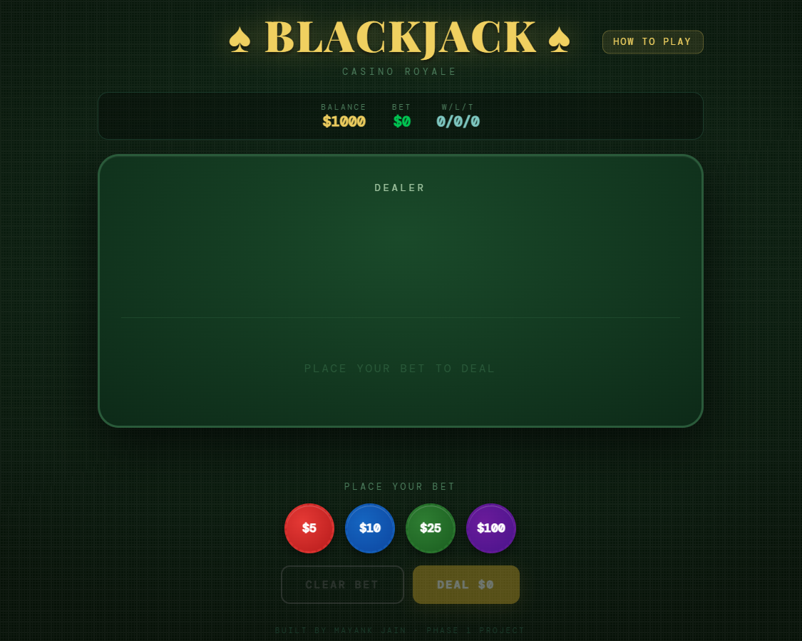

# Blackjack Game 🃏 

A browser-based Blackjack game built with **React**, developed from my original CLI implementation and transformed into an interactive web application.

## Live Demo

**[Play Blackjack →](https://blackjack-game-six-alpha.vercel.app)**

## Preview



## Features

- Betting system with $5, $10, $25 and $100 chips
- Hit, Stand and Double Down actions
- Dealer logic that hits below 17
- Win, loss and tie tracking
- Built-in How to Play guide
- Responsive interface for desktop and mobile

## Tech Stack

- **React.js**
- **JavaScript**
- **CSS / Inline Styling**
- **Vercel** for deployment

## Development

The project started as a **CLI Blackjack implementation**. I then developed it into an interactive React-based web interface and deployed the application using Vercel.

## Run Locally

```bash
npm install
npm start
```

The application will run locally at `http://localhost:3000`.

## Project Links

- **Live Demo:** https://blackjack-game-six-alpha.vercel.app
- **Source Code:** https://github.com/Mayank123J/Blackjack-Game

## Author

**Mayank Jain**  
B.Tech — Artificial Intelligence & Data Science

[GitHub](https://github.com/Mayank123J) · [LinkedIn](https://www.linkedin.com/in/mayank-jain-0b8414322/)
